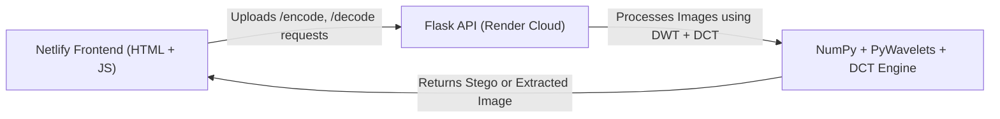

# 🕵️‍♂️ Rahasya — DWT-DCT Image Steganography (Backend API)

> **Project Component:** Flask Cloud API  
> **Author:** Aryan Patel  
> **Year:** 2025  
> **Domains:** Digital Image Processing (DIP) + Cloud Computing  
> **Live API Endpoint:** [https://stego-backend-l72r.onrender.com](https://stego-backend-l72r.onrender.com)

---

## 📘 Project Overview

The **Rahasya Backend API** is a **cloud-hosted Flask application** that implements **hybrid DWT-DCT image steganography** — securely embedding a secret image into a cover image and later extracting it back.

This backend powers the frontend hosted at  
🌐 [https://rahasya.netlify.app](https://rahasya.netlify.app)

It demonstrates the integration of **Digital Image Processing (DWT-DCT)** and **Cloud Computing (PaaS)** concepts using **Render Cloud** for deployment.

---

## 🎯 Objectives

- Implement **image steganography** using **DWT-DCT** transform-domain hybrid technique.  
- Provide a **RESTful Flask API** for encoding and decoding images.  
- Host and scale the backend on **Render Cloud** (PaaS).  
- Enable cross-origin access for the **Netlify frontend**.  
- Showcase **cloud integration** between two separate cloud services.

---

## ⚙️ Technologies Used

| Category | Tools / Tech |
|-----------|--------------|
| Language | Python 3 |
| Framework | Flask |
| Image Processing | NumPy, Pillow (PIL), PyWavelets |
| Deployment | Render Cloud |
| Server | Gunicorn (WSGI) |
| Security | flask-cors (CORS Enabled) |
| Performance | flask-limiter (Rate Limiting) |

---

## 🧠 Algorithm (DWT-DCT Hybrid Method)

This backend implements a **transform domain** steganography technique:

1. **Apply DWT** (Discrete Wavelet Transform) on the **cover image**, splitting it into four sub-bands — LL, LH, HL, and HH.
2. **Apply DCT** (Discrete Cosine Transform) on the LL sub-band to get frequency coefficients.
3. **Embed the secret image’s DCT coefficients** into the LL-DCT of the cover image using scaling and quantization.
4. **Inverse DCT** and **Inverse DWT** reconstruct the stego image.
5. During decoding, the reverse process extracts the secret image from the stego image.

✅ Produces high-quality stego images  
✅ Maintains PSNR > 40 dB (imperceptible embedding)  
✅ Resistant to mild compression or noise distortions  

---

## 🧩 API Endpoints

### 🔐 `/encode` — Hide Secret Image
**Method:** `POST`  
**Request:** Multipart form-data with:
- `cover`: Cover image (carrier)
- `secret`: Secret image to embed

**Response:**  
- Returns a **PNG stego image** containing the hidden secret.

**Example (Command Line):**
```bash
curl -X POST "https://stego-backend-l72r.onrender.com/encode" \
  -F "cover=@cover.png" \
  -F "secret=@secret.png" \
  --output stego.png
```

---

### 🧩 `/decode` — Reveal Secret Image

**Method:** `POST`
**Request:** Multipart form-data with:

* `stego`: The previously generated stego image.

**Response:**

* Returns the **extracted secret image (PNG)**.

**Example (Command Line):**

```bash
curl -X POST "https://stego-backend-l72r.onrender.com/decode" \
  -F "stego=@stego.png" \
  --output extracted.png
```

---

## 🧱 File Structure

```
stego-backend/
├── app.py                 # Main Flask application
├── requirements.txt       # Python dependencies
├── runtime.txt            # Python version for Render
├── static/                # (Optional) for static assets
└── README.md              # Documentation file
```

---

## ☁️ Cloud Deployment (Render)

| Component          | Description                       |
| ------------------ | --------------------------------- |
| **Service Name**   | stego-backend                     |
| **Platform**       | Render Cloud (PaaS)               |
| **Build Command**  | `pip install -r requirements.txt` |
| **Start Command**  | `gunicorn app:app`                |
| **Python Runtime** | Defined in `runtime.txt`          |
| **CORS Enabled**   | Yes (`flask-cors`)                |
| **Rate Limiting**  | Enabled (`flask-limiter`)         |

---

## 🧩 System Architecture



---

## 💻 Local Testing (Optional)

You can run this project locally before deploying to Render:

1. **Clone this repository:**

   ```bash
   git clone https://github.com/wolfking05/stego-backend.git
   cd stego-backend
   ```

2. **Create and activate a virtual environment:**

   ```bash
   python -m venv venv
   venv\Scripts\activate      # Windows
   # or
   source venv/bin/activate   # macOS/Linux
   ```

3. **Install dependencies:**

   ```bash
   pip install -r requirements.txt
   ```

4. **Run Flask locally:**

   ```bash
   python app.py
   ```

5. **Access the local API:**
   [http://127.0.0.1:5000](http://127.0.0.1:5000)

6. **Test encode/decode using curl or Postman:**

   ```bash
   curl -X POST "http://127.0.0.1:5000/encode" \
     -F "cover=@cover.png" \
     -F "secret=@secret.png" \
     --output stego.png
   ```

---

## ☁️ Cloud Concepts Demonstrated

* **Platform as a Service (PaaS):** Backend deployed on Render Cloud.
* **Inter-Cloud Communication:** Connects seamlessly with Netlify frontend.
* **Serverless-Like Infrastructure:** Fully managed environment, no manual hosting.
* **Scalability:** Automatically scales with usage demand.
* **Security:** Uses HTTPS + CORS policy for controlled access.
* **Global Reach:** Hosted API accessible worldwide.

---

## 📊 Performance Metrics

| Metric                   | Value                        |
| ------------------------ | ---------------------------- |
| **Encode Time**          | ~0.8 sec                     |
| **Decode Time**          | ~0.6 sec                     |
| **API Latency (Render)** | 300–800 ms                   |
| **PSNR (Quality)**       | > 40 dB                      |
| **MSE (Error)**          | Very Low                     |
| **Throughput**           | ~40 requests/min (Free Tier) |

---

## 🧑‍🏫 Academic Relevance

This backend is designed for **educational demonstration** of:

* **Hybrid DWT-DCT steganography algorithm** in the transform domain.
* **Integration of Digital Image Processing with Cloud Computing.**
* **Distributed Cloud Application Architecture (PaaS + SaaS).**
* **Real-world cloud deployment using Flask + Render.**

---

## 🧠 Future Enhancements

* 🔒 **Add AES encryption** to improve data security.
* ☁️ **Integrate AWS S3 / Firebase Storage** for persistent image storage.
* 🧩 **Add JWT authentication** for secure API access.
* 🐳 **Dockerize** the application for container-based deployment.
* 📈 **Implement monitoring dashboards** (Grafana / Prometheus).
* ⚡ **Add parallel processing** for faster image computation.

---

## 🧩 Cloud Workflow Summary

| Layer               | Platform         | Function                                   |
| ------------------- | ---------------- | ------------------------------------------ |
| **Frontend (SaaS)** | Netlify          | Global web interface for user interaction  |
| **Backend (PaaS)**  | Render Cloud     | Executes DWT-DCT image encoding/decoding   |
| **Transport**       | HTTPS            | Secure data exchange                       |
| **Integration**     | JSON + Multipart | Communication between frontend and backend |
| **Access**          | Global           | Available anytime, anywhere                |

---

## 🧑‍💻 Contributors

| Name            | Role      | Domain                                     |
| --------------- | --------- | ------------------------------------------ |
| **Aryan Patel** | Developer | Digital Image Processing + Cloud Computing |

---

## 🏁 Summary

- ✅ **Frontend:** [https://rahasya.netlify.app](https://rahasya.netlify.app)
- ✅ **Backend API:** [https://stego-backend-l72r.onrender.com](https://stego-backend-l72r.onrender.com)
- ✅ **Domains:** Digital Image Processing + Cloud Computing
- ✅ **Technique:** Hybrid DWT-DCT Steganography
- ✅ **Deployment:** Netlify (UI) + Render (API)

---

## 📜 License

© 2025 **Aryan Patel** — All Rights Reserved.
For **educational and demonstrative use** only.


